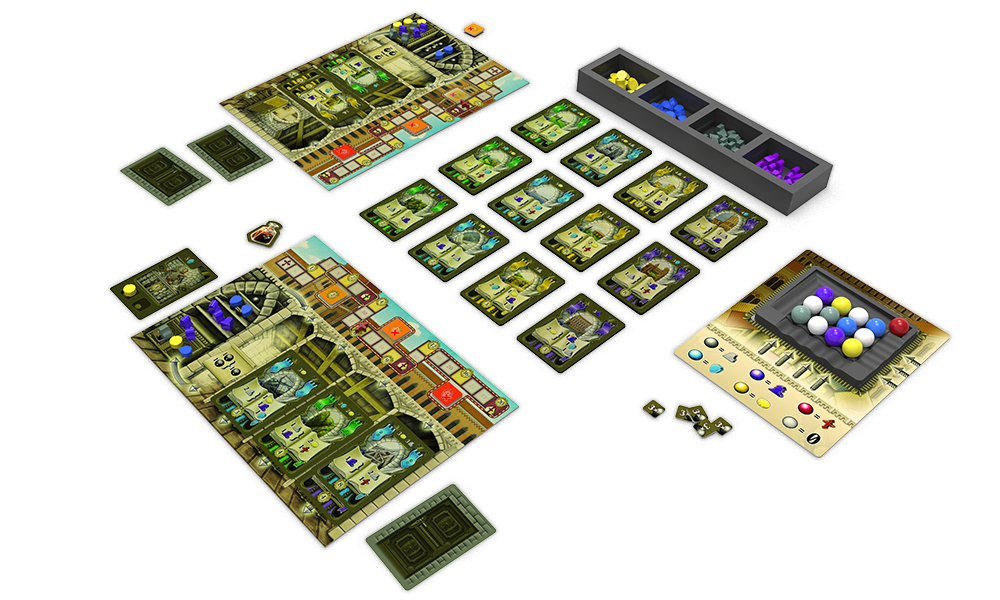

# Masters of Renaissance Multiplayer Board Game

This repository contains the code and documentation artifacts for the Java implementation of the Masters of Renaissance: Lorenzo il Magnifico board game. The project has been implemented by myself and another international student to be part of a mandatory course in my PoliMi Computer Science & Engineering MSc programme.

**Table of Contents**

- [About the Board Game](#about-the-physical-board-game)
- [Our Java Implementation](#our-java-implementation)
  - [Class Diagrams](#class-diagrams)
  - [Sequence Diagrams](#sequence-diagrams)
- [How to Run the Game](#how-to-run-the-game)
- [Screenshots of the Game](#screenshots-of-the-game)

## About the Board Game

The game is a multiplayer card game that can be played by up to 4 people. Each player have different kinds of resources and different kinds of cards. Players take turns to execute their selection of actions. There are different kinds of situations that triggers the end of the game, and the winner is chosen according a specific point-counting system.

<p align="center" >

</p>

- For the official webiste of the game, refer to [https://craniointernational.com/products/masters-of-renaissance/](https://craniointernational.com/products/masters-of-renaissance/)

- For the entire set of rules on how to play the game, refer to the [rulebook](docs/Masters-of-Renaissance-Rules.pdf)
- For a short video tutorial of the game, refer to [https://youtu.be/0DaaO49X4xw](https://youtu.be/0DaaO49X4xw)
- For a complete playthrough of two players, refer to [https://youtu.be/PqQhw71V2R0](https://youtu.be/PqQhw71V2R0)

## Our Java Implementation

In our design, we shared tasks into a **one common server instance**, and **one client instance per player**. We mainly made use of **Model-View-Controller** and **Publisher/Listener** patterns with the notion of **events** between different MVC components. From the network aspect, we utilized low-level **socket programming**, and took advantage of **multi-threading** in our server to handle different client connections. Our implementation **does not rely on third-party libraries or frameworks**, except for **core Java utilities** and **GSON** library that we used to serialize/deserialize Java objects into/from JSON notation.

### Class Diagrams

- [Initial MVC Design Class Diagram](/deliveries/final/UML/ClassDiagramMVC.pdf)
- [Final Auto-Generated Class Diagram of Entire Application](/deliveries/final/UML/finalClassDiagram.pdf)

### Sequence Diagrams

- [Connecting to the Server](/deliveries/final/UML/sequenceDiagram/LoginSequenceDiagram.pdf)
- [Activation of a Leader Card](/deliveries/final/UML/sequenceDiagram/activateLeaderCardSequenceDiagram.pdf)
- [Taking Resources from Market Tray](/deliveries/final/UML/sequenceDiagram/TakeResourcesDiagramSequenceDiagram.pdf)

## How to Run the Game?

You can try our game by running server and client .jar files present in the [deliveries folder](./deliveries/final/Jar), simply by:

```bash
java -jar Server.jar
```

```bash
java -jar Client.jar
```

1. First, run the server. The port number is 30000 and it is hardcoded in the server class.

2. Run the client. If you want to connect to a local server, you should enter "localhost" as the IP of the server, while port number remains 30000. If you want to connect to a remote server on a different network, you should enter the public IP address of the remote server with the same port number.

3. The first player connected to the server enters player name and total number of players, as shown in the screenshot with light gray background below.

4. After the connection of the other player(s) and their selection of playernames, the server randomly assigns turn order of players.

5. Next, just like physical board game counterpart, the server sends each player four leader cards and asks them to choose two of them.

6. As the last step before the first action of first player, initial resources are transfered to players with respect to the game rules.

7. The first players starts the game by executing his/her selection of actions.

8. The game continues in turn order and when one of the criteria which ends the game is met, the game finishes by giving players who have not played in that turn the right to play their last turn.

9. The points of players are counted by server and the winner is announced to players.

## Screenshots of the Game

- Running server jar:

<p>

</p>

- Running client jars for first and second player respectively:

<p>

</p>

<p>

</p>

- Common market tray:

<p>

</p>

- Faith track and personal board that shows available resources and owned cards:

<p>

</p>

- Action selection menu and activation of production action:

<p>

</p>

- Management of warehouse resources:

<p>

</p>

- Viewing other player(s)'s personal boards:

<p>

</p>

## Contributors

- Ömer Esas
- Amor Madhkour
